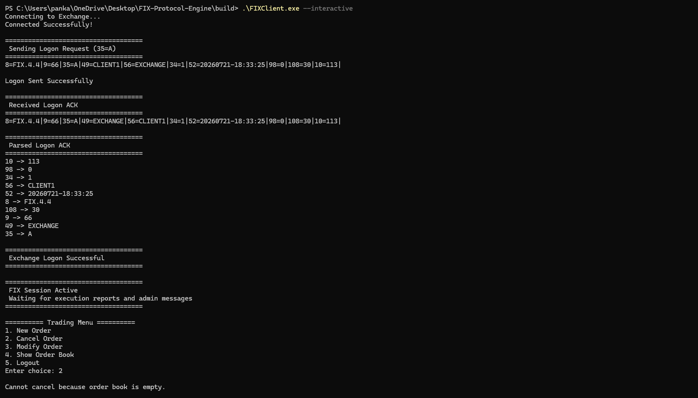
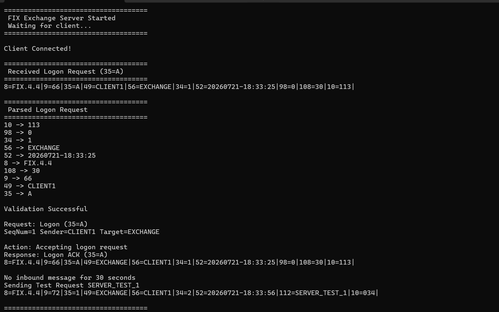
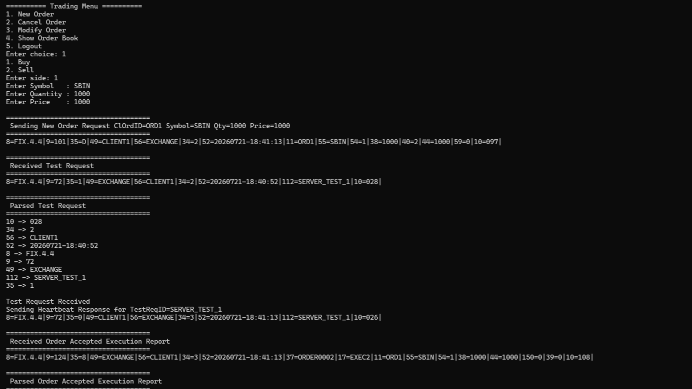
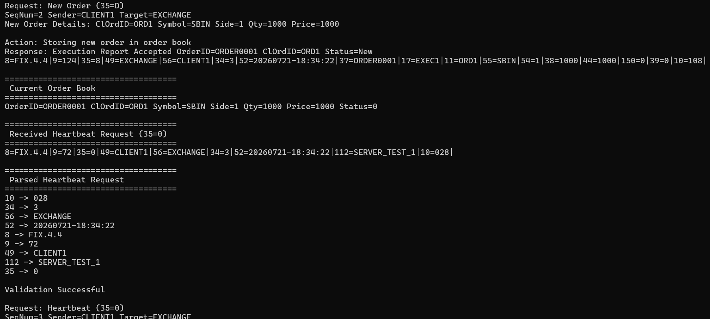
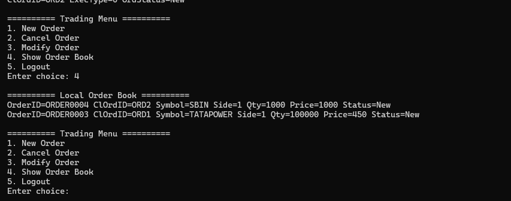

# FIX Protocol Engine

A C++ FIX 4.4 learning project that demonstrates how a trading client and an exchange server communicate using real FIX tag-value messages over TCP.

The project includes a FIX encoder, parser, message validator, session sequence handling, a simple exchange server, a client trading menu, execution reports, cancel/replace handling, heartbeat/test-request handling, and a local order book view.

## What This Project Shows

- Sending FIX messages from a client to an exchange server.
- Receiving FIX responses from the server.
- Parsing raw FIX messages into tag-value fields.
- Validating `BodyLength` (`9`), `CheckSum` (`10`), required tags, and sequence numbers.
- Handling session messages such as Logon, Heartbeat, Test Request, and Logout.
- Handling application messages such as New Order Single, Cancel Order, Modify Order, and Execution Report.
- Showing which FIX message is sent for each trading condition and what the server sends back.

## Screenshots

### Client Sends Logon and Receives ACK

The client starts a FIX session by sending a Logon message (`35=A`). The server validates it and sends a Logon ACK (`35=A`) back.



### Server Sends ACK and Test Request

The exchange server receives the client Logon, parses the fields, validates the message, sends the Logon ACK, and can send a Test Request (`35=1`) when no inbound message is received during the heartbeat interval.



### Client Sends New Order

After logon, the client sends a New Order Single (`35=D`) containing order details such as `ClOrdID`, symbol, side, quantity, order type, price, and time-in-force.



### Server Receives New Order and Sends Execution Report

The server parses and validates the New Order Single. If valid, it stores the order in the exchange order book and sends an Execution Report (`35=8`) back to the client.



### Local Order Book

The client keeps a local order book from the execution reports it receives from the server.



## Message Flow

| Condition | Client Sends | Server Action | Server Sends Back |
| --- | --- | --- | --- |
| Start session | Logon (`35=A`) | Validates logon tags, body length, checksum, and sequence number | Logon ACK (`35=A`) |
| Place order | New Order Single (`35=D`) | Stores order in server order book | Execution Report accepted (`35=8`, `150=0`, `39=0`) |
| Cancel order | Order Cancel Request (`35=F`) | Searches order book using `OrigClOrdID` | Execution Report canceled (`150=4`, `39=4`) or rejected (`150=8`, `39=8`) |
| Modify order | Order Cancel/Replace Request (`35=G`) | Searches order book and updates quantity/price | Execution Report replaced (`150=5`, `39=0`) or rejected (`150=8`, `39=8`) |
| No message within heartbeat interval | Test Request (`35=1`) | Peer must prove session is alive | Heartbeat (`35=0`) with matching `112=TestReqID` |
| End session | Logout (`35=5`) | Closes FIX session cleanly | Logout ACK (`35=5`) |

## Supported FIX Messages

| MsgType | Name | Direction |
| --- | --- | --- |
| `35=A` | Logon | Client to server, server to client |
| `35=0` | Heartbeat | Client to server, server to client |
| `35=1` | Test Request | Client to server, server to client |
| `35=5` | Logout | Client to server, server to client |
| `35=D` | New Order Single | Client to server |
| `35=F` | Order Cancel Request | Client to server |
| `35=G` | Order Cancel/Replace Request | Client to server |
| `35=8` | Execution Report | Server to client |

## Example FIX Messages

FIX uses ASCII `SOH` (`\x01`) as the field delimiter. For console readability, this project displays `SOH` as `|`.

### Logon Request

```text
8=FIX.4.4|9=66|35=A|49=CLIENT1|56=EXCHANGE|34=1|52=20260721-17:08:20|98=0|108=30|10=109|
```

Important fields:

| Tag | Meaning | Example |
| --- | --- | --- |
| `8` | BeginString | `FIX.4.4` |
| `9` | BodyLength | `66` |
| `35` | Message type | `A` |
| `49` | SenderCompID | `CLIENT1` |
| `56` | TargetCompID | `EXCHANGE` |
| `34` | Message sequence number | `1` |
| `52` | Sending time | `20260721-17:08:20` |
| `98` | EncryptMethod | `0` |
| `108` | HeartBtInt | `30` |
| `10` | Checksum | `109` |

### New Order Single

```text
8=FIX.4.4|9=111|35=D|49=CLIENT1|56=EXCHANGE|34=2|52=20260721-17:08:20|11=ORD000001|55=RELIANCE|54=1|38=100|40=2|44=2500.5|59=0|10=162|
```

Important fields:

| Tag | Meaning | Example |
| --- | --- | --- |
| `35=D` | New Order Single | Client is placing an order |
| `11` | ClOrdID | `ORD000001` |
| `55` | Symbol | `RELIANCE` |
| `54` | Side | `1` = Buy, `2` = Sell |
| `38` | OrderQty | `100` |
| `40` | OrdType | `2` = Limit |
| `44` | Price | `2500.5` |
| `59` | TimeInForce | `0` = Day |

### Execution Report

```text
8=FIX.4.4|9=137|35=8|49=EXCHANGE|56=CLIENT1|34=2|52=20260721-17:08:20|37=ORDER0001|17=EXEC0001|11=ORD000001|55=RELIANCE|54=1|38=100|44=2500.5|150=0|39=0|10=061|
```

Important fields:

| Tag | Meaning | Example |
| --- | --- | --- |
| `35=8` | Execution Report | Server response for order action |
| `37` | OrderID | `ORDER0001` |
| `17` | ExecID | `EXEC0001` |
| `11` | ClOrdID | `ORD000001` |
| `150` | ExecType | `0` = Accepted, `4` = Canceled, `5` = Modified, `8` = Rejected |
| `39` | OrdStatus | `0` = New, `4` = Canceled, `8` = Rejected |

## Parser and Validation

The parser reads a raw FIX message, splits fields using the `SOH` delimiter, separates each field into `tag=value`, and stores the result in a `FixMessage` object.

After parsing, the validator checks:

- `BodyLength` matches the actual message body.
- `CheckSum` matches the calculated checksum.
- Required fields are present for the received `MsgType`.
- Numeric fields such as quantity and price are valid.
- Side is valid: `1` for Buy or `2` for Sell.
- Execution reports use supported `ExecType` and `OrdStatus` values.
- Session sequence numbers arrive in the expected order.

## Project Structure

```text
.
|-- apps/
|   |-- client.cpp        # TCP FIX client and trading menu
|   `-- server.cpp        # TCP exchange server
|-- include/              # Public headers
|-- src/                  # FIX parser, encoder, validator, session, order book
|-- Images/               # README screenshots
|-- CMakeLists.txt
`-- README.md
```

## Build

This project uses CMake and Winsock, so it is intended to run on Windows.

```powershell
cmake -S . -B build
cmake --build build
```

The build creates:

- `FIXServer`
- `FIXClient`
- `FIXEngine`

## Run

Start the exchange server first:

```powershell
.\build\FIXServer.exe
```

In another terminal, start the client:

```powershell
.\build\FIXClient.exe
```

Interactive client mode:

```powershell
.\build\FIXClient.exe --interactive
```

Useful client flags:

| Flag | Behavior |
| --- | --- |
| `--interactive` | Opens the trading menu for new, cancel, modify, order book, and logout actions |
| `--logout-after-report` | Sends Logout after receiving an execution report |
| `--cancel-after-report` | Sends a cancel request after the first accepted execution report |
| `--modify-after-report` | Sends a modify request after the first accepted execution report |

## Current Features

- FIX 4.4 message encoding.
- FIX message parsing.
- Body length calculation.
- Checksum calculation and validation.
- Required tag validation by message type.
- Client/server TCP communication on `127.0.0.1:5001`.
- Session sequence number validation.
- Logon, heartbeat, test request, logout flow.
- New order, cancel order, and modify order flow.
- Exchange-side order book.
- Client-side local order book built from execution reports.

## Future Improvements

- FIX dictionary driven validation.
- More complete reject message handling.
- Persistent order storage.
- Non-blocking/asynchronous networking.
- Cross-platform socket abstraction.
- Unit tests and integration tests.
- Benchmarking for parser and encoder latency.
